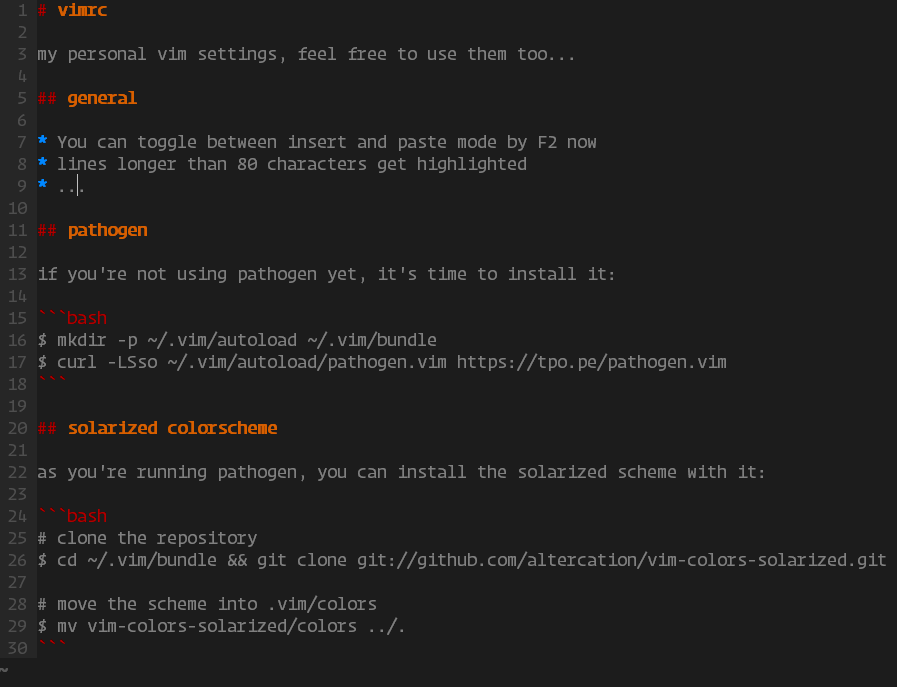

# vimrc

my personal vim settings, feel free to use them too...

## general

* You can toggle between insert and paste mode by F2 now
* lines longer than 80 characters get highlighted
* ...

## pathogen

if you're not using pathogen yet, it's time to install it:

```bash
$ mkdir -p ~/.vim/autoload ~/.vim/bundle 
$ curl -LSso ~/.vim/autoload/pathogen.vim https://tpo.pe/pathogen.vim
```

## solarized colorscheme

as you've installed pathogen, you can install the solarized scheme with it:

```bash
# clone the repository
$ cd ~/.vim/bundle && git clone git://github.com/altercation/vim-colors-solarized.git

# move the scheme into .vim/colors
$ mv vim-colors-solarized/colors ../.
```





** TypeScript Syntax Highlighting

using pathogen again to install this feature:

```bash
git clone https://github.com/leafgarland/typescript-vim.git ~/.vim/bundle/typescript-vim
```
