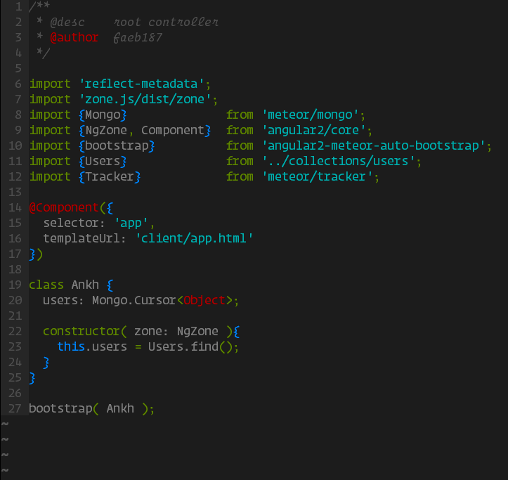

# vimrc

my personal vim settings, feel free to use them too...

## Installation

```bash
# backup current .vimrc
$ cd ~ && mv ~/.vimrc ~/.vimrc.bak

# install .vimrc from this repository
$ git clone git@github.com:faeb187/vimrc.git

# add a symbolic link to the .vimrc (update with ease)
$ ln -s vimrc/.vimrc .vimrc
```

In order to make this version running you need to install some dependencies
(or comment out what you don't need, it's up to you)...

### Pathogen

if you're not using pathogen yet, it's time to install it:

```bash
$ mkdir -p ~/.vim/autoload ~/.vim/bundle 
$ curl -LSso ~/.vim/autoload/pathogen.vim https://tpo.pe/pathogen.vim
```

### Solarized Colorscheme

as you've installed pathogen, you can install the solarized scheme with it:

```bash
# clone the repository
$ cd ~/.vim/bundle && git clone git@github.com:altercation/vim-colors-solarized.git

# move the scheme into .vim/colors
$ mv vim-colors-solarized/colors ../.
```

not working yet? try:

```bash
# add this line into ~/.bashrc
export TERM="xterm-256color"

# close the file, then from terminal:
$ source ~/.bashrc
```

### Syntax Highlighting

#### TypeScript

```bash
# requires pathogen
$ git clone https://github.com/leafgarland/typescript-vim.git ~/.vim/bundle/typescript-vim
```

#### Docker

```bash
# requires pathogen
$ git clone https://github.com/ekalinin/Dockerfile.vim.git ~/.vim/bundle/Dockerfile
```

#### Jade

```bash
# requires pathogen
$ cd ~/.vim/bundle
$ git clone git://github.com/digitaltoas/vim-pug.git
```

#### Coffee

```bash
# requires pathogen
$ cd ~/.vim/bundle
$ git clone https://github.com/kchmck/vim-coffee-script.git
```

#### Stylus

```bash
# requires pathogen
$ cd ~/.vim/bundle
$ git clone git://github.com/waded/vim-stylus.git
```

## Screenshots




